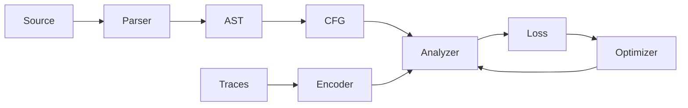

# Implementation Plan: Neural Abstract Interpretation

## Goals
- Define a simplified C language with functions, assignments, arithmetic, if, while, and return.
- Implement a neural abstract domain with learnable abstract operators.
- Support differentiable analysis with soft branching and loop fixpoint iteration.
- Train using fuzzed execution traces and an over/under-approximation objective.

## Scope and Assumptions
- Types: int and bool only.
- Memory model: function-local scalar variables, no heap/arrays/pointers.
- Control flow: if/else, while loops, and function calls with call/return.
- Abstract states are latent vectors; operators are neural networks.

## Architecture Overview
- Frontend: parser -> AST -> CFG per function.
- Semantics core: concrete interpreter and abstract interpreter.
- Neural domain: encoder, transfer, join, meet, widen/narrow (optional).
- Training: trace collection, supervision signals, loss computation, optimizer.

## Data Flow

## Components and Interfaces
1. Language frontend
   - Parser for the simplified C subset.
   - AST nodes for expressions, statements, and functions.
   - CFG builder with explicit basic blocks and edges.
2. Concrete semantics
   - Small-step or big-step evaluator to generate ground-truth traces.
   - State = env: var -> int/bool, plus call stack.
3. Neural abstract domain
   - Abstract state h in R^d.
   - Abstraction alpha: concrete state -> h (encoder).
   - Concretization gamma: h -> set of concrete states (implicit via loss).
   - Join/meet: neural networks g_join, g_meet.
   - Transfer: neural networks per statement type.
4. Differentiable analysis
   - Soft branching: replace hard if with weighted merge.
   - Loop handling: iterative fixpoint with damping.
5. Training pipeline
   - Fuzzing-based trace generator.
   - Trace to supervision signal (may be partial).
   - Loss: penalize under-approx and over-approx errors.
   - Optimizer: SGD/Adam with scheduled learning rate.

## Milestones
1. Frontend MVP
   - Parse and build CFG for simple programs with functions.
2. Concrete interpreter and trace generator
   - Execute programs and collect states at CFG nodes.
3. Neural domain prototype
   - Implement alpha, join, and transfer for core statements.
4. Differentiable analysis
   - Soft branching and loop fixpoint iterations.
5. Training and evaluation
   - Train on fuzzed traces and evaluate precision/recall of invariants.

## Risks and Mitigations
- Training instability: use gradient clipping and smaller learning rate.
- Poor generalization: diversify fuzzing seeds and add curriculum.
- Fixpoint divergence: use damping and limit iterations.

## Deliverables
- `docs/semantics.md`: formal semantics and neural abstract interpretation rules.
- Reference implementation plan (this document).
